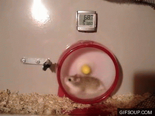

# Java Hausaufgaben
...powered by a small hamster

###Info

Hier können wir die Hausaufgaben hochladen, damit 
Marius sie später zusammen auf Ilias abgeben kann

__Die Hausaufgaben müssen jeweils Dienstag Nacht im Ilias sein !__

###News

- Davids __HA9__ ist online! Ich hab sie nur neu "gepackaged" und dann hochgeladen. Wenn niemand was dazu zu sagen hat, dann lade ich sie morgen Abend hoch!

###Gruppe

1. Marius Bronner
* Niklas Dahl
* David Neuroth

##Aufgabenverteilung:
Müssen wir nochmal absprechen, aber hier ein Vorschlag von Marius:   
* Marius Bronner: Aufgaben | Nummer%3 == 0   
* Niklas Dahl: Aufgaben | Nummer%3 == 1   
* David Neuroth: Aufgaben | Nummer%3 == 2   

###ToDo:
- [ ] __HA6__ verkraften
- [ ] __HA9__ absenden

### [History](History.md)
-- (Die History wurde etwas zu lang, daher jetzt eine eigene Datei!)
